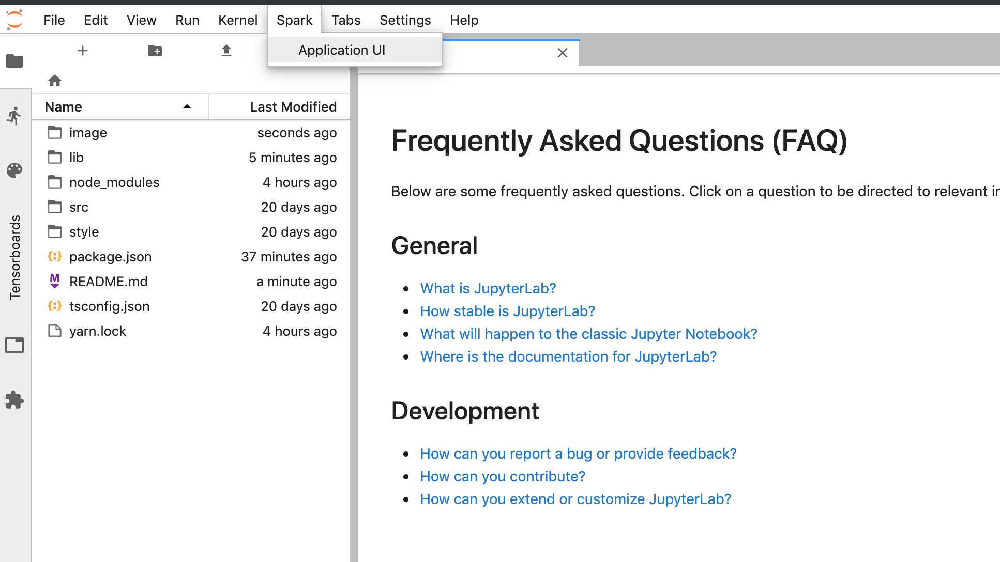
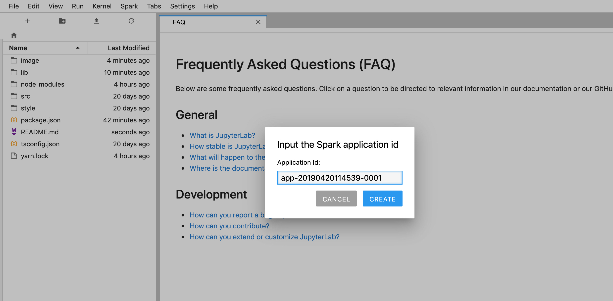
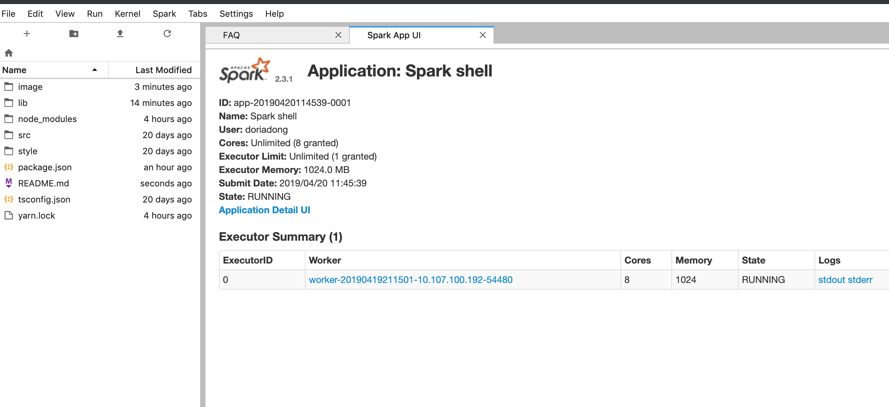

# jupyterlab_spark
[](https://www.npmjs.com/package/jupyterlab_spark)
[](https://github.com/manuzhang/jupyterlab_spark/actions)


A JupyterLab extension to show Spark Application UI in a JupyterLab panel

## Prerequisites

* JupyterLab

## Installation

```bash
jupyter labextension install jupyterlab_spark
```

## Usage

> Note: the extension only works with Spark application running in client mode.

0. Add the following configuration to `spark-defaults.conf` to allow framing from localhost

```
spark.ui.allowFramingFrom    http://localhost
```

1. Click on the "Application UI" item from the new "Spark" menu 



2. Input the Spark application id in the popped up dialog and click on "CREATE"



The id can be found in driver log or output of executing `sparkContext.applicationId`

3. Here is your Spark application UI. Enjoy!



## Development

For a development install (requires npm version 4 or later), do the following in the repository directory:

```bash
npm install
npm run build
jupyter labextension link .
```

To rebuild the package and the JupyterLab app:

```bash
npm run build
jupyter lab build
```

## Acknowledgement

Thanks to the [xkcd exntension tutorial](https://jupyterlab.readthedocs.io/en/stable/developer/xkcd_extension_tutorial.html) and [cookiecutter template](https://github.com/jupyterlab/extension-cookiecutter-ts). I'm especially inspired by the [jupyterlab_tensorboard](https://github.com/chaoleili/jupyterlab_tensorboard) project where I also 
shamelessly borrowed some codes.

